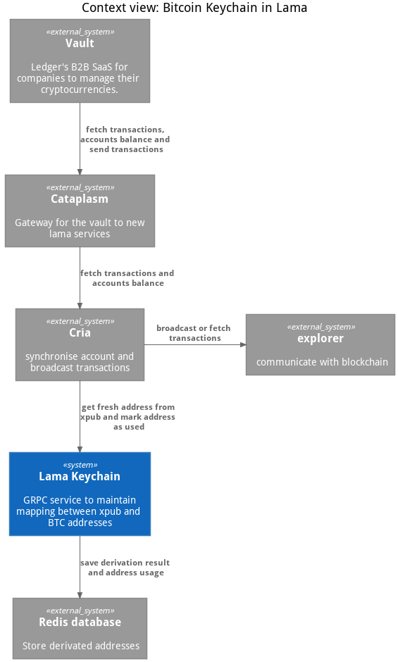
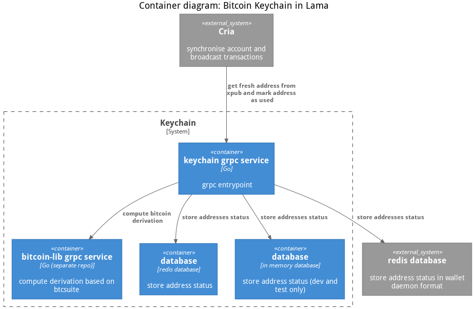
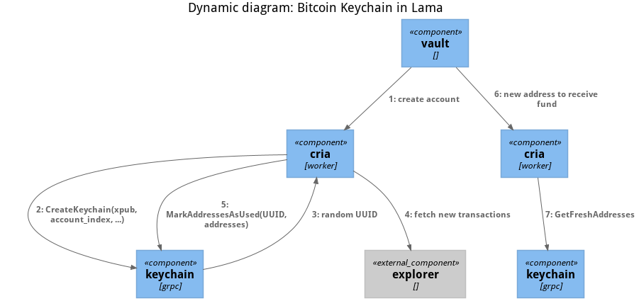

# bitcoin-keychain
Keychain gRPC service for Bitcoin (like) currencies

## Intro

bitcoin-keychain is a RPC server that helps you derive new addresses from an
xpub and maintains mapping between those.

The responsibilities of keychain are:
 - derive address for a given derivation path
 - get fresh receive and change addresses
 - reverse lookup of address to derivation path: for transaction creation, we need
to check the address associated to the path belong to the account (not asked by protocol but by hardware wallet)
 - get the public key of an address: needed for transaction creation by protocol
 - manage gaps

The [interface](pb/keychain/service.proto) is defined as protobuf

## [C4Model](https://c4model.com) Architecture

### Context diagram

### Container diagram

### Dynamic diagram

When a new account is registered, the keychain has to be called on
[CreateKeychain](https://github.com/LedgerHQ/bitcoin-keychain/blob/0.5.2/pb/keychain/service.proto#L11)
with the [xpub and some other information](https://github.com/LedgerHQ/bitcoin-keychain/blob/0.5.2/pb/keychain/service.proto#L102)
This methods returns a keychain id (among other informations). It is a UUID
randomly created. This UUID will be needed for all subsequent communication, so
all keychain client needs to store it.

When this is done, the LAMA btc worker needs to regularly maintains the
address usage status with [MarkAddressesAsUsed](https://github.com/LedgerHQ/bitcoin-keychain/blob/0.5.2/pb/keychain/service.proto#L24)
This method needs a list of addresses and the keychain id.
This is typically done after scanning the explorer or after a new transaction

When new addresses are needed, either for receiving fund or for UTXO, the
keychain client can call one of
[GetFreshAddresses](https://github.com/LedgerHQ/bitcoin-keychain/blob/0.5.2/pb/keychain/service.proto#L27)
or [GetAllObservableAddresses](https://github.com/LedgerHQ/bitcoin-keychain/blob/0.5.2/pb/keychain/service.proto#L30)

### Notes

Data can be stored in different backend:
 - redis
 - in memory
 - WD

We use "in memory" storage for tests / development.

In production, both "redis" and "wd" write in a redis database. The difference
is "wd" write in the wallet daemon's "user pref" format for smooth transition
with the wallet daemon.

You have to choose which backend with the environment variable `STORE_TYPE`

All data stored can be recalculated from `xpub`s at the price of a costly
computation, so you can see this component as a cache.

## Tests

We have unittest and integration test

### Unittest

`mage test`

### Integration test

`mage integration`

This test suite create a grpc client and a keychain server running in "redis"
mode.
This mean you also need to setup a redis server to run those tests.

## Related component

The keychain is used by [lama](https://github.com/LedgerHQ/lama)

The keychain use [lib-grpc](https://github.com/LedgerHQ/bitcoin-lib-grpc/) for
Hierarchical Deterministic Wallets computation (lib-grpc uses
[btcsuite](https://github.com/btcsuite/btcutil) itself)
