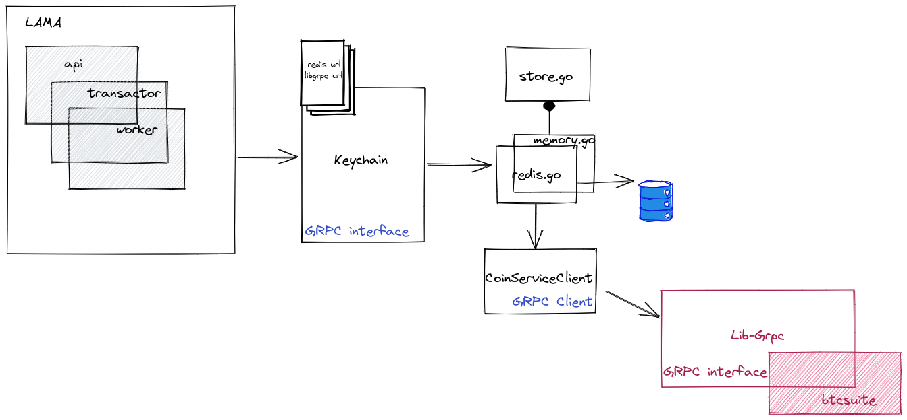

# bitcoin-keychain
Keychain gRPC service for Bitcoin (like) currencies

## Intro

bitcoin-keychain is a RPC server that helps you derive new addresses from an
xpub and maintains mapping between those.

The responsibilities of keychain are:
 - derive address for a given derivation path
 - get fresh receive and change addresses
 - reverse lookup of address to derivation path
 - get the public key of an address
 - manage gaps

The interface is defined as [protobuf](pb/keychain/service.proto)

## Architecture

Data can be stored in different backend:
 - redis
 - in memory

We use "in memory" storage for tests / development and redis for production.

All data stored can be recalculated from `xpub`s at the price of a costly
computation, so you can see this component as a cache.

## Related component

The keychain is used by [lama](https://github.com/LedgerHQ/lama)

The keychain use [lib-grpc](https://github.com/LedgerHQ/bitcoin-lib-grpc/) for
Hierarchical Deterministic Wallets computation (lib-grpc uses
[btcsuite](https://github.com/btcsuite/btcutil) itself)
